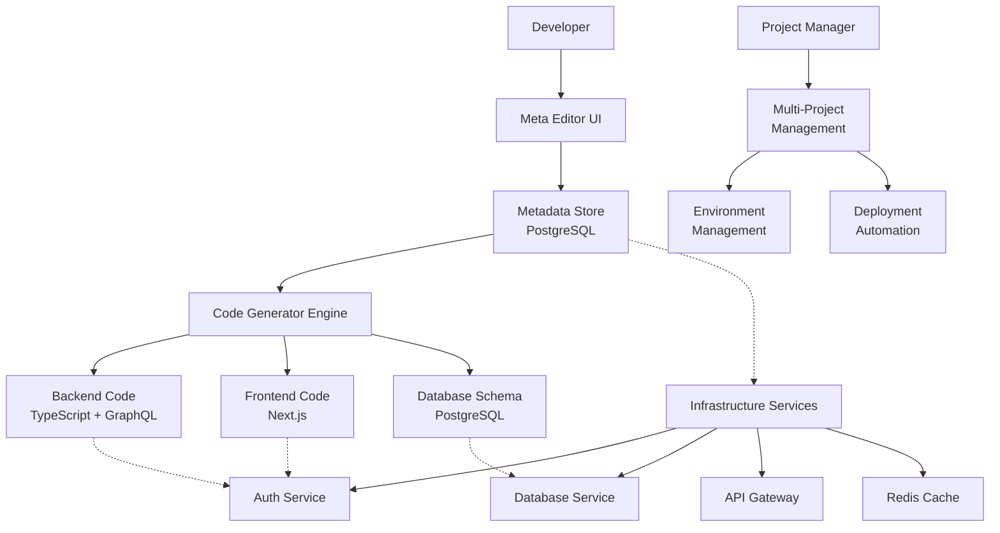
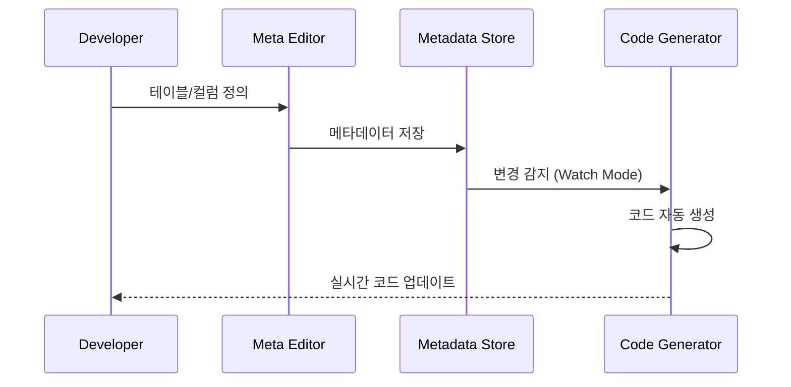
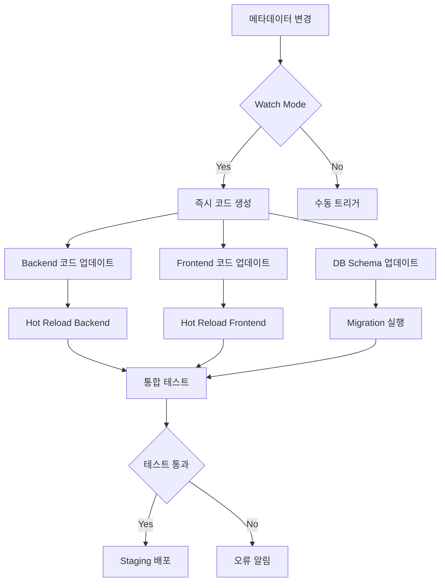

# 메타데이터 기반 개발 플랫폼 - 전체 WorkFlow 및 구조도

## 🎯 핵심 아키텍처



## 📋 전체 WorkFlow

### Phase 1: 프로젝트 초기화
```bash
# 1. 플랫폼 생성
./cu.sh <platformName>  # 인프라 템플릿 생성

# 2. 프로젝트 생성
./cp.sh <projectName>   # 프로젝트 템플릿 생성

# 3. 개발 환경 시작
npm run dev:meta        # 메타데이터 편집기 실행
```

### Phase 2: 데이터 모델링 (메타데이터 정의)


### Phase 3: 코드 생성 및 동기화
```yaml
자동 생성 대상:
  Database:
    - DDL Scripts (CREATE TABLE)
    - Migration Scripts
    - Index 생성

  Backend:
    - GraphQL Schema
    - GraphQL Resolvers
    - Database Models
    - API Routes
    - TypeScript Types

  Frontend:
    - React Forms
    - Data Tables
    - TypeScript Types
    - API Clients
```

## 🔧 핵심 구성 요소

### A. 메타데이터 관리 시스템
```sql
-- 핵심 테이블들
- projects                 # 프로젝트 관리
- mappings_table          # 테이블 메타데이터
- mappings_column         # 컬럼 메타데이터
- mappings_relation       # 테이블 관계
- mappings_api_endpoint   # API 엔드포인트
- project_environments    # 환경별 설정
```

### B. 인프라 서비스 레이어
```yaml
Infrastructure Services:
  Auth Service (Port 20101):
    - JWT 기반 인증
    - RBAC 권한 관리
    - 다중 프로젝트 접근 제어

  Database Service (Port 3002):
    - 프로젝트별 DB 자동 생성
    - Migration 관리
    - Backup/Restore

  API Gateway (Port 20100):
    - 통합 인증 검증
    - Rate Limiting
    - Request Routing

  Redis Cache (Port 6379):
    - 세션 관리
    - API 응답 캐싱
    - 실시간 알림 (Pub/Sub)
```

### C. 개발자 도구
```yaml
Development Tools:
  Meta Editor:
    - 웹 기반 메타데이터 편집기
    - 실시간 코드 미리보기
    - 관계 시각화

  Code Generator:
    - Watch Mode 지원
    - 증분 생성
    - 커스텀 템플릿

  Multi-Environment:
    - Development (Hot Reload)
    - Staging (Compiled)
    - Production (Optimized)
```

## ⚙️ 자동화 WorkFlow

### 개발 프로세스 자동화


### 배포 자동화
```yaml
Deployment Pipeline:
  Development:
    - 파일 변경 감지
    - 자동 코드 생성
    - Hot Reload

  Staging:
    - 컴파일된 코드
    - Production 환경 시뮬레이션
    - 통합 테스트

  Production:
    - 최적화된 빌드
    - 무중단 배포
    - 모니터링
```

## 📊 관리 허브 통합

### 통합 관리 대시보드
```yaml
Management Hub Features:
  Project Management:
    - 프로젝트 생성/삭제
    - 팀 멤버 관리
    - 권한 설정

  Infrastructure Management:
    - 사용자 관리
    - 데이터베이스 관리
    - 서비스 모니터링

  Development Tools:
    - 메타데이터 편집기
    - 코드 생성 상태
    - 배포 관리

  Analytics:
    - 사용량 통계
    - 성능 모니터링
    - 오류 추적
```

## 🚀 실제 구현 단계

### Phase 1: Core Infrastructure (4-6주)
1. PostgreSQL 메타데이터 스키마 구축
2. 인프라 서비스 개발 (Auth, Database, Gateway)
3. 기본 Docker 환경 구성

### Phase 2: Code Generation Engine (6-8주)
1. 메타데이터 파서 개발
2. 코드 생성 엔진 구현
3. 템플릿 시스템 구축

### Phase 3: Developer Tools (4-6주)
1. 웹 기반 메타데이터 편집기
2. 실시간 코드 미리보기
3. Watch Mode 구현

### Phase 4: Management & Automation (6-8주)
1. 관리 허브 개발
2. 배포 자동화
3. 모니터링 대시보드

## 📈 기대 효과

### 개발 생산성 향상
- **80% 이상의 보일러플레이트 코드 자동 생성**
- **즉시 프로토타이핑 가능**
- **일관된 코드 품질 보장**

### 운영 효율성
- **중앙집중식 사용자/권한 관리**
- **프로젝트별 독립적 환경**
- **자동화된 배포 파이프라인**

### 확장성
- **새로운 프로젝트 빠른 추가**
- **커스텀 코드 생성기 플러그인**
- **다양한 기술 스택 지원**

---

> 이 시스템을 구축하면 **메타데이터 기반 RAD(Rapid Application Development)** 환경이 완성되어, 아이디어에서 실제 서비스까지의 시간을 획기적으로 단축할 수 있을 것입니다.